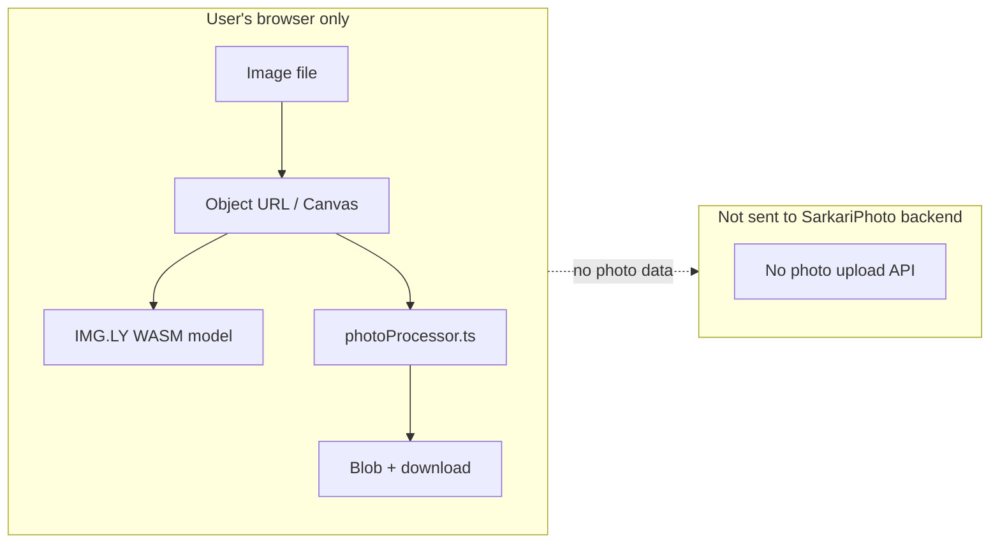
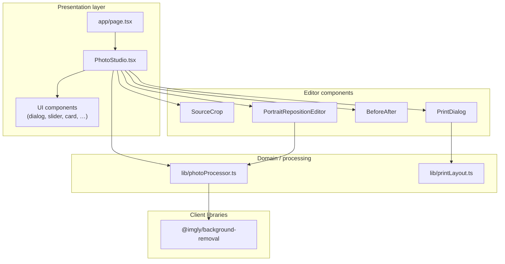
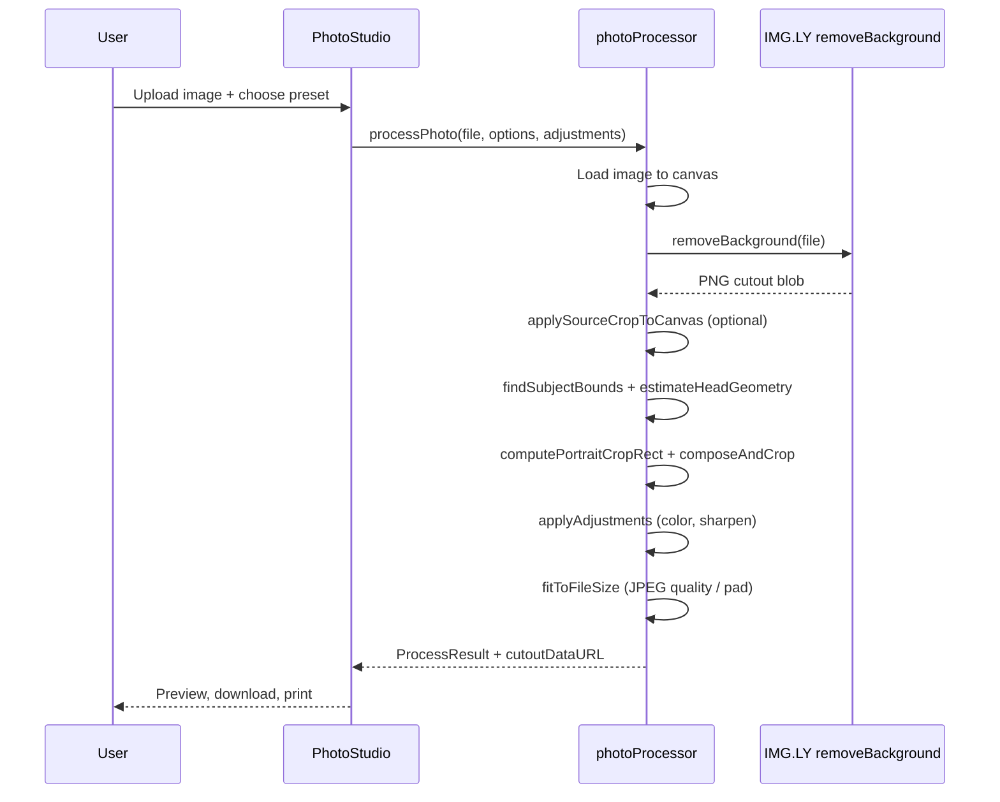
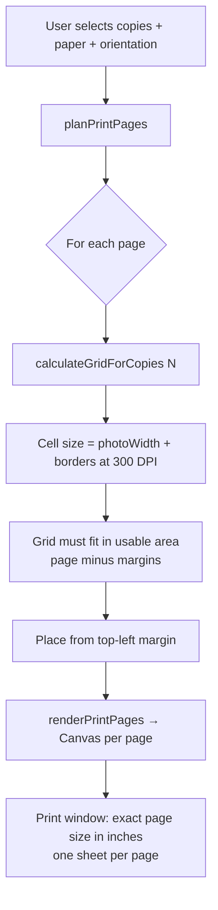

<p align="center">
  <strong>SarkariPhoto</strong><br/>
  <em>Passport, ID &amp; signature photos for Indian and international government forms — entirely in your browser.</em>
</p>

<p align="center">
  <a href="https://github.com/Sidmaz666/sarkariphoto">Repository</a> ·
  <a href="#quick-start">Quick Start</a> ·
  <a href="#features">Features</a> ·
  <a href="#architecture">Architecture</a>
</p>

---

## Table of Contents

1. [Overview](#overview)
2. [Why SarkariPhoto](#why-sarkariphoto)
3. [Features](#features)
4. [Privacy &amp; Data Handling](#privacy--data-handling)
5. [Architecture](#architecture)
6. [Processing Pipeline](#processing-pipeline)
7. [Print Layout Engine](#print-layout-engine)
8. [Government Templates](#government-templates)
9. [Project Structure](#project-structure)
10. [Technology Stack](#technology-stack)
11. [Quick Start](#quick-start)
12. [Usage Guide](#usage-guide)
13. [Configuration](#configuration)
14. [Core Modules Reference](#core-modules-reference)
15. [Development](#development)
16. [Deployment](#deployment)
17. [Limitations &amp; Roadmap](#limitations--roadmap)
18. [Contributing](#contributing)
19. [Acknowledgements](#acknowledgements)

---

## Overview

**SarkariPhoto** (package name: `portraitpro`) is a client-side web application that turns an ordinary phone or webcam photo into a **government-form-ready portrait or signature**. It targets the exact requirements Indian and international portals enforce: pixel dimensions, JPEG/PNG format, file size in kilobytes, white or specified backgrounds, and sensible head framing.

The entire workflow runs **locally in the browser**. Photos are not uploaded to a SarkariPhoto server for processing. Background removal uses the [`@imgly/background-removal`](https://www.npmjs.com/package/@imgly/background-removal) library (WebAssembly / ONNX in-browser). Cropping, face framing, color adjustment, and file-size optimization use the **Canvas API** and custom logic in `lib/photoProcessor.ts`.

| Attribute | Detail |
|-----------|--------|
| **Product name** | SarkariPhoto |
| **Version** | See `lib/version.ts` (`APP_VERSION`) |
| **Framework** | Next.js 16 (App Router) |
| **UI** | React 19, Tailwind CSS 4, shadcn/ui, Radix UI |
| **Primary locale** | India (`en_IN` metadata) |
| **License** | See repository for license terms |

---

## Why SarkariPhoto

Government and exam portals reject uploads for predictable reasons:

- Wrong **width × height** (e.g. 200×230 for Indian passport online forms vs 413×531 for Aadhaar 35×45 mm).
- File **too large or too small** in KB (e.g. 20–50 KB for passport, ≤240 KB for US DS-160).
- **Background** not plain white or off-white.
- **Head size** or eye line outside acceptable composition.

SarkariPhoto encodes these rules as **searchable presets** (50+ templates) and applies a consistent pipeline so users get a downloadable file that matches their chosen spec without manual Photoshop work.

---

## Features

### Portrait & ID photos

- **50+ presets** across India (identity, exams, travel permits), international visas, professional use, and signatures.
- **AI background removal** (in-browser) for portrait mode.
- **Automatic head detection & framing** using alpha-channel subject bounds and estimated head geometry (eye line, head height percentage).
- **Manual source crop** before processing (drag handles, undo/redo, apply/cancel).
- **Reposition subject** after generation with **WYSIWYG preview** (same render path as save via `renderPortraitOutputFrame`).
- **Composition guide** overlay for passport-style alignment.
- **Adjustments**: brightness, contrast, saturation, hue, sharpen, upscale factor.
- **Output optimization**: JPEG quality search and optional padding to hit min/max KB; PNG with guidance when size exceeds limits.
- **Before/after** comparison view.
- **Pipeline progress** UI with per-step status (load → background removal → detect → compose → size → done).

### Signatures

- Dedicated **signature presets** (standard, small, square, wide).
- No background removal — resize and fit on white background with same KB targeting.

### Print layout

- Multi-copy **print sheets** on 4×6, 5×7, A4, or Letter paper.
- **True physical size per copy**: each photo prints at `widthPx ÷ DPI × heightPx ÷ DPI` inches (default 300 DPI).
- **Top-left packing** with configurable borders, spacing, and cut marks.
- **Multi-page** output when selected copy count exceeds one sheet; print dialog opens one page per sheet at exact paper dimensions.
- Download PNG (single or per-page).

### UX

- Drag-and-drop or file picker (JPG, PNG, HEIC, WebP).
- Searchable template dropdown with categories.
- Custom dimensions, KB range, format, and background color.
- Responsive layout; PWA manifest for installability.

---

## Privacy & Data Handling



| Data | Where it lives | Sent to server? |
|------|----------------|-----------------|
| Original image | Memory / object URLs | **No** (no upload endpoint in this app) |
| Cutout cache (`cutoutDataURL`) | Session state (data URL) | **No** |
| Processed result | Blob URL in browser | **No** |
| IMG.LY model weights | Fetched from CDN on first use (library default) | Model assets only, not user photos |

**Implications:**

- Suitable for users who do not want ID photos on a third-party server.
- First background removal may download WASM/models (network for library assets).
- Clearing the page or clicking **New** revokes object URLs and resets state.

---

## Architecture

### High-level system view



### Component responsibility map

| Component | Responsibility |
|-----------|----------------|
| `app/page.tsx` | Landing hero, mounts `PhotoStudio`, footer |
| `PhotoStudio.tsx` | Central state: file, presets, adjustments, crop, pipeline, result |
| `SourceCrop.tsx` | Normalized crop rectangle on source image (pre-process) |
| `PortraitRepositionEditor.tsx` | Canvas preview of cutout + crop window; maps drag to `offsetX/Y`, `scale` |
| `CropOverlay.tsx` | Legacy/simple overlay (reposition uses `PortraitRepositionEditor`) |
| `EditToolbar.tsx` | Undo, redo, cancel, save actions below preview card |
| `PrintDialog.tsx` | Paper/orientation/copies, preview, print & download |
| `PipelineProgress.tsx` | Step list during `processPhoto` / `reprocessPhoto` |
| `CompositionGuide.tsx` | Rule-of-thirds / head guide on preview |
| `BeforeAfter.tsx` | Side-by-side source vs result |

---

## Processing Pipeline

### Portrait mode (`processPhoto`)



### Framing logic (conceptual)

Head geometry is inferred from the **alpha mask** of the cutout (not a separate face API):

1. **Subject bounds** — scan for non-transparent pixels.
2. **Head top, chin, eye line** — row-wise width analysis for head height and face center.
3. **Crop rectangle** — sized so head occupies `headHeightPct` of frame; eye line at `eyeLinePct` from top; aspect ratio = `widthPx / heightPx`.
4. **User adjustments** — `offsetX`, `offsetY`, `scale` shift/zoom the crop on the cutout before final render.
5. **Padding** — if crop extends past canvas, `ensureCropFits` pads with background color.

`reprocessPhoto` skips background removal and reuses stored `cutoutDataURL` for faster iteration when repositioning or changing sliders.

### Signature mode

Skips IMG.LY and face geometry. Draws source image letterboxed on target canvas with white fill, applies adjustments, then `fitToFileSize`.

---

## Print Layout Engine

Located in `lib/printLayout.ts`. Designed for **home printing** of multiple passport-size copies on standard paper.

### Layout rules



| Concept | Behavior |
|---------|----------|
| **Photo size on paper** | Each copy uses full output pixels at sheet DPI (e.g. 200×230 px → 0.67″×0.77″ @ 300 DPI) |
| **Position** | Top-left; not centered on sheet |
| **Overflow copies** | Additional pages automatically (up to 48 copies selectable) |
| **Options** | Photo borders, inter-photo spacing, corner/dashed cut marks |

### Paper sizes

| ID | Size | DPI |
|----|------|-----|
| `4x6` | 6″ × 4″ | 300 |
| `5x7` | 7″ × 5″ | 300 |
| `a4` | A4 | 300 |
| `letter` | US Letter | 300 |

**Portrait orientation** swaps width/height for the printable page dimensions.

---

## Government Templates

Presets live in `PRESETS` inside `lib/photoProcessor.ts`. Each entry defines:

- `widthPx`, `heightPx` — output dimensions  
- `minKB`, `maxKB` — target file size range  
- `format` — `jpeg` or `png`  
- `bgColor` — background hex (e.g. `#FFFFFF`, OCI uses light gray `#E8E8E8`)  
- `headHeightPct`, `eyeLinePct` — framing (portraits)  
- `signature: true` — signature pipeline  

### Categories (summary)

| Category | Examples | Count (approx.) |
|----------|----------|-----------------|
| **India · Identity** | Passport online, Passport Seva, PAN, Aadhaar (413×531), Voter ID, DL, OCI, EWS, PCC | 9 |
| **India · Travel Permits** | Arunachal / Nagaland / Mizoram ILP, Sikkim PAP | 4 |
| **India · Travel** | e-Visa, IRCTC | 2 |
| **India · Exams** | UPSC, SSC, NDA, CDS, NEET, JEE, CAT, GATE, IBPS, RBI, LIC, RRB, CTET, CUET, CLAT, NET, Agniveer, State PSC | 18 |
| **International** | ICAO 35×45, US passport/DS-160, UK passport/visa, Schengen, EU visas, Canada, Australia, NZ, China, Japan, Korea, UAE, Malaysia, Hong Kong, Brazil | 17 |
| **Professional** | LinkedIn, Resume | 2 |
| **Signatures** | Standard, small, square, wide | 4 |
| **Custom** | User-defined dimensions | 1 |

> **Note:** Portal requirements change. Presets reflect commonly cited specifications (UIDAI 35×45 mm for Aadhaar, DS-160 600×600–1200×1200, OCI square 200–900 px, etc.). Users should verify against the **current** official portal before final submission.

---

## Project Structure

```
portraitpro/
├── app/
│   ├── layout.tsx          # Root layout, SEO, fonts, JSON-LD
│   ├── page.tsx            # Home page
│   ├── globals.css         # Tailwind + dialog scrollbar utilities
│   ├── loading.tsx         # Route loading UI
│   └── error.tsx           # Error boundary
├── components/
│   ├── PhotoStudio.tsx     # Main application shell
│   ├── SourceCrop.tsx      # Pre-process crop UI
│   ├── PortraitRepositionEditor.tsx
│   ├── PrintDialog.tsx
│   ├── BeforeAfter.tsx
│   ├── CompositionGuide.tsx
│   ├── PipelineProgress.tsx
│   ├── EditToolbar.tsx
│   └── ui/                 # shadcn/ui primitives
├── lib/
│   ├── photoProcessor.ts   # Presets, processPhoto, reprocessPhoto, framing
│   ├── printLayout.ts      # Grid layout, multi-page print canvases
│   ├── version.ts          # APP_VERSION, BUILD_TIME
│   └── utils.ts            # cn() helper
├── public/
│   └── manifest.json       # PWA manifest
├── next.config.ts
├── package.json
├── tsconfig.json
├── components.json         # shadcn config
└── README.md
```

---

## Technology Stack

| Layer | Technology |
|-------|------------|
| Runtime | Node.js 20+ (development) |
| Framework | [Next.js](https://nextjs.org/) 16.2 |
| UI library | [React](https://react.dev/) 19 |
| Language | TypeScript 5 |
| Styling | [Tailwind CSS](https://tailwindcss.com/) 4, `tw-animate-css` |
| Components | [shadcn/ui](https://ui.shadcn.com/) + [Radix UI](https://www.radix-ui.com/) |
| Icons | [Phosphor Icons](https://phosphoricons.com/) |
| Notifications | [Sonner](https://sonner.emilkowal.ski/) |
| Background removal | [@imgly/background-removal](https://www.npmjs.com/package/@imgly/background-removal) 1.7 |
| Image I/O | Canvas 2D API, `HTMLImageElement`, `Blob`, `FileReader` |

---

## Quick Start

### Prerequisites

- **Node.js** 20 or later  
- **npm** 9+ (or pnpm / yarn / bun)

### Install and run

```bash
git clone https://github.com/Sidmaz666/sarkariphoto.git
cd sarkariphoto   # or your clone folder name (portraitpro)
npm install
npm run dev
```

Open [http://localhost:3000](http://localhost:3000).

### Production build

```bash
npm run build
npm start
```

### Lint

```bash
npm run lint
```

---

## Usage Guide

### 1. Upload a photo

- Drag and drop onto the upload card, or click to browse.
- Best results: front-facing, even lighting, head and shoulders visible, plain background (optional but helps removal).

### 2. Choose a template

- Open **Template** in settings; search by name (e.g. “Aadhaar”, “DS-160”, “SSC”).
- Preset fills width, height, KB range, format, and background.

### 3. Optional: manual crop (before generate)

- Enable **Manual crop**; drag the crop rectangle on the source image.
- Use **Undo / Redo / Apply crop / Cancel** in the toolbar below the preview card.

### 4. Generate

- Click **Generate Portrait** (or **Re-generate** after changes).
- Wait for pipeline steps to complete (background removal is the slowest first time).

### 5. Optional: reposition (after generate)

- Enable **Reposition subject**; drag inside the dashed frame; zoom with on-canvas controls.
- **Save position** re-runs compose using stored cutout (fast). Preview inside frame matches saved output.

### 6. Download

- **Download** saves JPEG or PNG per preset rules.

### 7. Print multiple copies

- Click **Print**; choose paper, orientation, copy count (1–48).
- Preview shows sheet(s); **Print** opens browser print at true page size; **Download PNG** saves sheet image(s).

---

## Configuration

### Environment variables

| Variable | Purpose |
|----------|---------|
| `NEXT_PUBLIC_BASE_URL` | Canonical URL for metadata / Open Graph |
| `VERCEL_URL` | Auto-used on Vercel deployments |

### Version bump

Edit `lib/version.ts`:

```ts
export const APP_VERSION = "1.0.1";
export const BUILD_TIME = "2026-06-04T18:00:00Z";
```

### Adding a preset

Add an object to `PRESETS` in `lib/photoProcessor.ts`:

```ts
{
  id: "my-form",
  name: "My Form Name",
  category: "India · Exams",
  description: "200×230 px · 20–50 KB",
  widthPx: 200,
  heightPx: 230,
  minKB: 20,
  maxKB: 50,
  format: "jpeg",
  bgColor: "#FFFFFF",
  headHeightPct: 0.7,  // optional, default 70%
  eyeLinePct: 0.4,      // optional, default 40%
}
```

For signatures, set `signature: true`.

---

## Core Modules Reference

### `lib/photoProcessor.ts`

| Export | Description |
|--------|-------------|
| `PRESETS` | All government / professional templates |
| `processPhoto` | Full pipeline from `File` → `ProcessResult` + optional `cutoutDataURL` |
| `reprocessPhoto` | Re-compose from cutout with new adjustments / crop |
| `computePortraitCropRect` | Crop window on cutout (shared math) |
| `renderPortraitOutputFrame` | Exact output pixels (preview = save) |
| `applySourceCropToCanvas` | Apply normalized manual crop to cutout |
| `ensureCropFits` | Pad canvas when crop exceeds bounds |

### `lib/printLayout.ts`

| Export | Description |
|--------|-------------|
| `PAPER_SIZES` | Supported paper definitions |
| `planPrintPages` | Split `copies` across one or more sheets |
| `calculateGridForCopies` | Top-left grid for N copies at true pixel size |
| `maxCopiesOnPage` | Capacity at full size per sheet |
| `renderPrintPages` | `HTMLCanvasElement[]` for print/download |
| `getPhotoPrintSizeInches` | Physical inches per copy at DPI |

---

## Development

### Code conventions

- **App Router** only (`app/`); main UI is client components where state and canvas are required (`"use client"`).
- Shared types for crops and adjustments live in `photoProcessor.ts`.
- Prefer extending `PRESETS` and `printLayout` config over hardcoding dimensions in UI.

### Performance notes

- First background removal downloads model weights (may take several seconds).
- Large upscale factors increase canvas work in `composeAndCrop`.
- Print preview regenerates on dialog open and when layout options change (debounced ~120 ms).

### Browser support

- Modern Chromium, Firefox, Safari with Canvas and WASM support.
- HEIC depends on browser decode support for the uploaded file type.

---

## Deployment

### Vercel (recommended)

1. Import the GitHub repository.  
2. Framework preset: **Next.js**.  
3. Set `NEXT_PUBLIC_BASE_URL` to production URL.  
4. Deploy.

`next.config.ts` sets aggressive `Cache-Control: no-store` headers so HTML is not stale after deploys.

### Static hosting caveat

The app relies on client-side processing and Next.js server for the initial document. **Static export** (`output: 'export'`) is not configured by default; use Node hosting (`next start`) or Vercel.

### Self-hosted Docker (outline)

```dockerfile
FROM node:20-alpine AS builder
WORKDIR /app
COPY package*.json ./
RUN npm ci
COPY . .
RUN npm run build

FROM node:20-alpine AS runner
WORKDIR /app
ENV NODE_ENV=production
COPY --from=builder /app/.next ./.next
COPY --from=builder /app/node_modules ./node_modules
COPY --from=builder /app/package.json ./
COPY --from=builder /app/public ./public
EXPOSE 3000
CMD ["npm", "start"]
```

Adjust as needed for your orchestration platform.

---

## Limitations & Roadmap

| Limitation | Detail |
|------------|--------|
| No server-side face API | Framing uses cutout alpha heuristics; unusual poses may need manual reposition |
| IMG.LY model size | First load requires downloading ML assets |
| KB targets are best-effort | Extreme dimensions may not hit min/max KB even after quality search |
| Print color | Depends on printer drivers; screen preview is reference |
| Portal changes | Templates may need manual updates when specs change |

Possible future improvements: PDF print export, batch folder processing, offline PWA caching for models, explicit EXIF orientation fix UI.

---

## Contributing

Contributions are welcome, especially:

- **Preset updates** with links to official portal documentation.  
- **Bug fixes** for framing, KB targeting, or print layout.  
- **Accessibility** and mobile UX improvements.  

1. Fork the repository.  
2. Create a feature branch (`git checkout -b feature/my-change`).  
3. Commit with a clear message.  
4. Open a pull request describing the change and test plan.

Please do not commit secrets or `.env` files with API keys (this project does not require them for core features).

---

## Acknowledgements

- [IMG.LY](https://img.ly/) — `@imgly/background-removal` for in-browser segmentation.  
- [shadcn/ui](https://ui.shadcn.com/) — accessible UI primitives.  
- [Next.js](https://nextjs.org/) — application framework.  
- Built by [simaz666](https://github.com/simaz666) — see footer on the live app.

---

<p align="center">
  <sub>Documentation for SarkariPhoto / portraitpro — client-side government photo preparation.</sub>
</p>
